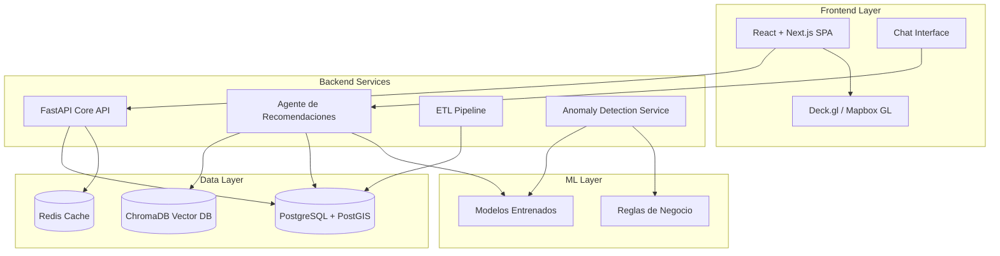
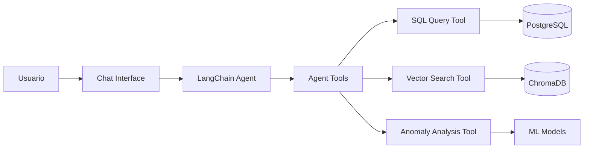
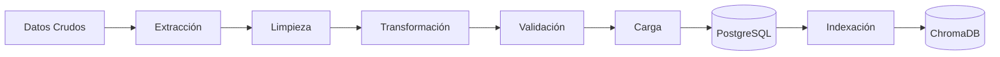
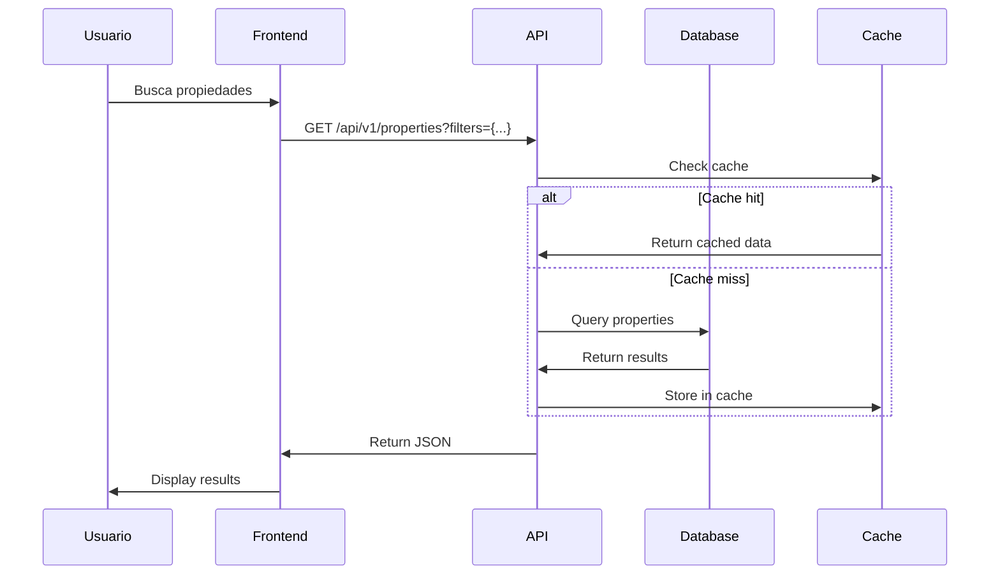
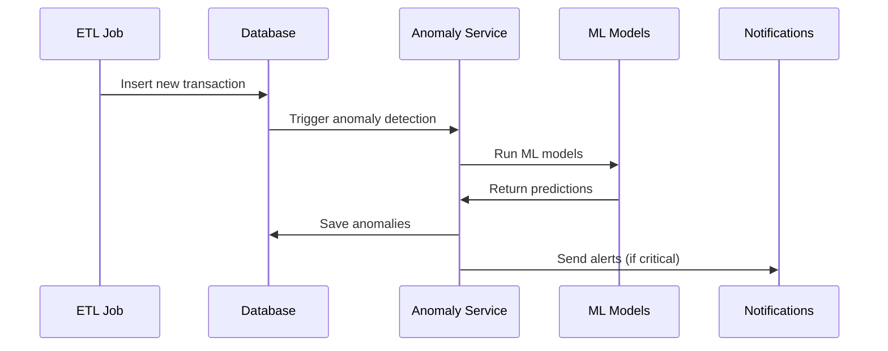
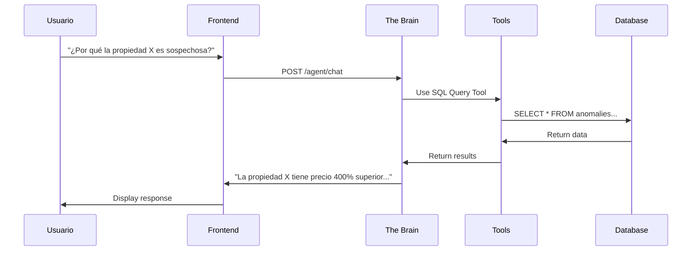

# Arquitectura del Sistema IMDADIC

## Visión General

IMDADIC es un sistema de monitoreo y detección de anomalías inmobiliarias que procesa más de 30 millones de registros de transacciones inmobiliarias en Colombia. El sistema utiliza una arquitectura de microservicios con tres componentes principales:

1. **Backend API** - Gestión de datos y lógica de negocio
2. **Agente de Recomendaciones (The Brain)** - Sistema de IA para análisis y explicaciones
3. **Frontend SPA** - Interfaz de usuario con visualizaciones interactivas

## Diagrama de Arquitectura



## Componentes Detallados

### 1. Frontend (React + Next.js)

#### Responsabilidades

- Visualización geoespacial de propiedades y anomalías
- Dashboard de indicadores clave (KPIs)
- Interfaz de chat con el agente de IA
- Gestión de filtros y búsquedas

#### Tecnologías Clave

- **Framework**: React 19 con Next.js para SSR/SSG
- **Mapas**: Deck.gl o Mapbox GL para visualizaciones de alto rendimiento
- **State Management**: React Query + Zustand
- **UI Components**: Tailwind CSS + ShadcnUI
- **Charts**: Recharts o Apache ECharts

#### Rutas Principales

- `/dashboard` - Vista general con KPIs y mapa de calor
- `/properties/:id` - Detalle de propiedad individual
- `/anomalies` - Lista y filtrado de anomalías detectadas
- `/chat` - Interfaz de conversación con The Brain
- `/reports` - Generación de reportes

### 2. Backend Core API (FastAPI)

#### Responsabilidades

- CRUD de propiedades y transacciones
- Autenticación y autorización de usuarios
- Exposición de endpoints para el frontend
- Procesamiento de consultas complejas
- Gestión de cache con Redis

#### Estructura de Endpoints

```
/api/v1/
├── /auth
│   ├── POST /login
│   ├── POST /refresh
│   └── POST /logout
├── /properties
│   ├── GET /          # Listado con paginación y filtros
│   ├── GET /:id       # Detalle de propiedad
│   └── GET /search    # Búsqueda avanzada
├── /anomalies
│   ├── GET /          # Lista de anomalías detectadas
│   ├── GET /:id       # Detalle de anomalía
│   └── POST /predict  # Nueva predicción
├── /dashboard
│   ├── GET /stats     # Estadísticas generales
│   ├── GET /kpis      # Indicadores clave
│   └── GET /heatmap   # Datos para mapa de calor
└── /reports
    ├── POST /generate # Generar reporte
    └── GET /:id       # Descargar reporte
```

#### Base de Datos (PostgreSQL + PostGIS)

**Tablas Principales:**

```sql
-- Propiedades
properties (
    id UUID PRIMARY KEY,
    cadastral_code VARCHAR UNIQUE,
    address TEXT,
    municipality VARCHAR,
    department VARCHAR,
    area_m2 DECIMAL,
    location GEOMETRY(Point, 4326),  -- PostGIS
    created_at TIMESTAMP,
    updated_at TIMESTAMP
)

-- Transacciones
transactions (
    id UUID PRIMARY KEY,
    property_id UUID REFERENCES properties(id),
    transaction_date DATE,
    transaction_type VARCHAR,  -- venta, hipoteca, etc.
    price DECIMAL,
    currency VARCHAR DEFAULT 'COP',
    buyer_info JSONB,
    seller_info JSONB,
    created_at TIMESTAMP
)

-- Anomalías Detectadas
anomalies (
    id UUID PRIMARY KEY,
    property_id UUID REFERENCES properties(id),
    transaction_id UUID REFERENCES transactions(id),
    anomaly_type VARCHAR,  -- price, frequency, area, etc.
    severity VARCHAR,  -- low, medium, high, critical
    confidence_score DECIMAL,
    detection_date TIMESTAMP,
    explanation TEXT,
    metadata JSONB,
    resolved BOOLEAN DEFAULT FALSE,
    resolved_at TIMESTAMP,
    resolved_by UUID
)

-- Usuarios
users (
    id UUID PRIMARY KEY,
    email VARCHAR UNIQUE,
    hashed_password VARCHAR,
    role VARCHAR,  -- admin, analyst, viewer
    created_at TIMESTAMP
)
```

### 3. Agente de Recomendaciones (The Brain)

#### Responsabilidades

- Responder preguntas sobre anomalías en lenguaje natural
- Explicar por qué una propiedad es sospechosa
- Sugerir investigaciones adicionales
- Generar resúmenes de patrones detectados

#### Arquitectura del Agente



#### Herramientas del Agente

1. **ConsultarSQL**: Ejecuta consultas SQL seguras
2. **BuscarSemántica**: Busca en documentación y contexto histórico
3. **AnalizarAnomalía**: Ejecuta análisis de anomalía en tiempo real
4. **GenerarMapa**: Crea visualización geoespacial
5. **CompararPropiedades**: Compara múltiples propiedades

#### Ejemplo de Prompt Template

```python
SYSTEM_PROMPT = """
Eres un asistente experto en análisis inmobiliario para el IGAC.
Tu objetivo es ayudar a analistas a entender anomalías en transacciones.

Tienes acceso a:
- Base de datos de 30M+ transacciones (vía SQL)
- Documentación técnica (vía búsqueda vectorial)
- Modelos de detección de anomalías

Cuando expliques una anomalía:
1. Proporciona contexto estadístico
2. Compara con el mercado local
3. Identifica patrones sospechosos
4. Sugiere pasos de investigación

Sé conciso, técnico y específico.
"""
```

### 4. ETL Pipeline

#### Responsabilidades

- Extracción de datos de múltiples fuentes
- Limpieza y normalización
- Geocodificación de direcciones
- Validación de integridad
- Carga incremental

#### Fases del ETL



#### Jobs de Procesamiento

1. **Daily Ingestion**: Carga diaria de nuevas transacciones
2. **Geocoding**: Conversión de direcciones a coordenadas
3. **Deduplication**: Identificación de duplicados
4. **Anomaly Detection**: Ejecución de modelos ML
5. **Vector Embedding**: Generación de embeddings para ChromaDB

### 5. Anomaly Detection Service

#### Tipos de Anomalías

| Tipo | Descripción | Método de Detección |
|------|-------------|---------------------|
| **Precio Atípico** | Precio fuera de rango estadístico | Isolation Forest, Z-score |
| **Flipping Rápido** | Múltiples ventas en corto tiempo | Reglas de negocio |
| **Área Inconsistente** | Discrepancia entre registros | Validación cruzada |
| **Concentración** | Múltiples propiedades mismo comprador | Graph Analysis |
| **Ubicación Imposible** | Coordenadas inválidas | PostGIS validation |

#### Pipeline de Detección

```python
# Pseudo-código del pipeline
def detect_anomalies(property_data):
    results = []
    
    # 1. Análisis estadístico
    if is_price_outlier(property_data):
        results.append(PriceAnomaly(severity="high"))
    
    # 2. Reglas de negocio
    if rapid_flipping_detected(property_data):
        results.append(FlippingAnomaly(severity="critical"))
    
    # 3. ML Models
    ml_score = ml_model.predict(property_data)
    if ml_score > THRESHOLD:
        results.append(MLAnomaly(confidence=ml_score))
    
    return results
```

## Flujo de Datos

### Flujo de Consulta de Usuario



### Flujo de Detección de Anomalías



### Flujo de Chat con Agente



## Seguridad

### Autenticación y Autorización

- **JWT Tokens** con refresh tokens
- **RBAC (Role-Based Access Control)**:
  - `admin`: Acceso completo
  - `analyst`: Lectura + análisis
  - `viewer`: Solo lectura
- **Rate Limiting** en API
- **SQL Injection Prevention** con ORMs (SQLAlchemy)

### Protección de Datos

- Encriptación en tránsito (HTTPS/TLS)
- Encriptación en reposo para datos sensibles
- Logs de auditoría para todas las acciones
- Anonimización de datos personales en reportes

## Escalabilidad

### Horizontal Scaling

- API stateless que puede replicarse
- Load balancer (nginx) para distribución
- Database read replicas para consultas
- Redis cluster para cache distribuido

### Optimizaciones

- **Indexación en PostgreSQL**:
  - B-tree index en `cadastral_code`, `municipality`
  - GiST index en columnas `location` (PostGIS)
  - JSONB GIN index en columnas `metadata`
- **Query Optimization**:
  - Materialized views para reportes
  - Partitioning de tabla `transactions` por fecha
- **Caching Strategy**:
  - Cache de estadísticas agregadas (TTL: 1 hora)
  - Cache de resultados de búsqueda (TTL: 15 min)

## Deployment

### Docker Compose (Desarrollo)

```yaml
services:
  postgres:
    image: postgis/postgis:17-3.4
    volumes:
      - pgdata:/var/lib/postgresql/data
  
  redis:
    image: redis:7-alpine
  
  chromadb:
    image: chromadb/chroma:latest
  
  backend:
    build: ./backend
    depends_on:
      - postgres
      - redis
  
  agent:
    build: ./backend/agent
    depends_on:
      - chromadb
      - postgres
  
  frontend:
    build: ./frontend
    depends_on:
      - backend
```

### Producción (Kubernetes - Futuro)

- Deployment con Helm charts
- Auto-scaling basado en CPU/memoria
- Persistent volumes para PostgreSQL
- Secrets management con Vault

## Monitoreo y Observabilidad

### Métricas Clave

- **Performance**:
  - Latencia de API (p50, p95, p99)
  - Throughput de requests
  - Query time en base de datos
- **Business**:
  - Anomalías detectadas por día
  - Usuarios activos
  - Propiedades procesadas
- **Infraestructura**:
  - CPU/memoria/disco
  - Redis hit rate
  - Database connections pool

### Herramientas

- **Logging**: Structured logging con JSON
- **Metrics**: Prometheus + Grafana
- **Tracing**: OpenTelemetry (futuro)
- **Alerting**: Configuración de alertas para anomalías críticas

## Referencias

- [FastAPI Documentation](https://fastapi.tiangolo.com/)
- [LangChain Documentation](https://python.langchain.com/)
- [PostGIS Documentation](https://postgis.net/documentation/)
- [Deck.gl Documentation](https://deck.gl/)
