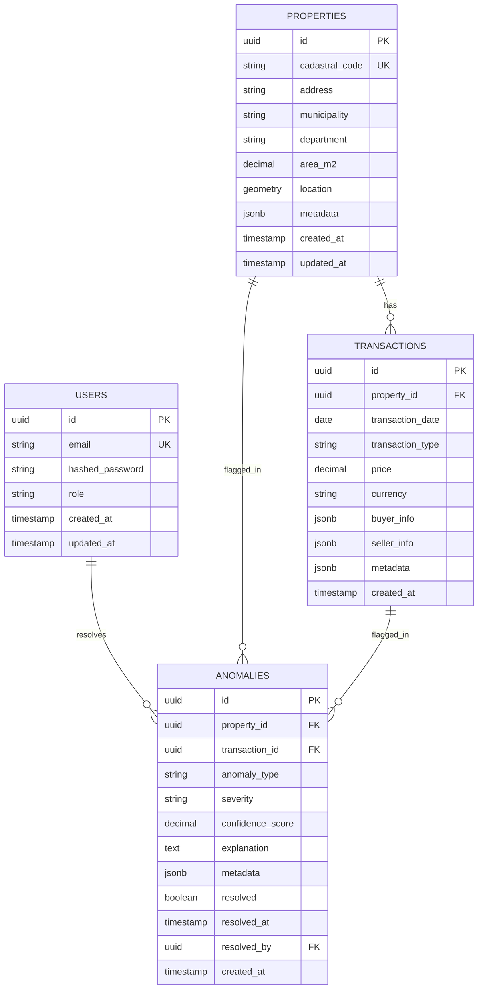

# Modelo de Datos - IMDADIC

## Diagrama de Entidad-Relación



## Descripción de Tablas

### `users`

Tabla de usuarios del sistema con roles de acceso.

| Columna | Tipo | Restricciones | Descripción |
|---------|------|---------------|-------------|
| `id` | UUID | PK, NOT NULL | Identificador único |
| `email` | VARCHAR(255) | UNIQUE, NOT NULL | Email del usuario |
| `hashed_password` | VARCHAR(255) | NOT NULL | Password hasheado con bcrypt |
| `role` | VARCHAR(50) | NOT NULL | Rol: 'admin', 'analyst', 'viewer' |
| `created_at` | TIMESTAMP | NOT NULL, DEFAULT NOW() | Fecha de creación |
| `updated_at` | TIMESTAMP | NOT NULL, DEFAULT NOW() | Última actualización |

**Índices**:

- PK en `id`
- UNIQUE en `email`

---

### `properties`

Tabla principal de propiedades inmobiliarias.

| Columna | Tipo | Restricciones | Descripción |
|---------|------|---------------|-------------|
| `id` | UUID | PK, NOT NULL | Identificador único |
| `cadastral_code` | VARCHAR(50) | UNIQUE, NOT NULL | Código catastral (matrícula inmobiliaria) |
| `address` | TEXT | | Dirección completa |
| `municipality` | VARCHAR(100) | NOT NULL | Municipio |
| `department` | VARCHAR(100) | NOT NULL | Departamento |
| `area_m2` | DECIMAL(12,2) | | Área en metros cuadrados |
| `location` | GEOMETRY(Point, 4326) | | Coordenadas geográficas (PostGIS) |
| `metadata` | JSONB | | Información adicional variable |
| `created_at` | TIMESTAMP | NOT NULL, DEFAULT NOW() | Fecha de creación |
| `updated_at` | TIMESTAMP | NOT NULL, DEFAULT NOW() | Última actualización |

**Índices**:

- PK en `id`
- UNIQUE en `cadastral_code`
- B-tree en `municipality`
- B-tree en `department`
- GiST en `location` (espacial)
- GIN en `metadata` (JSONB)

**Ejemplo de `metadata`**:

```json
{
  "property_type": "apartment",
  "zone": "residential",
  "stratum": 3,
  "construction_year": 2015,
  "rooms": 3,
  "bathrooms": 2
}
```

---

### `transactions`

Tabla de transacciones inmobiliarias asociadas a propiedades.

| Columna | Tipo | Restricciones | Descripción |
|---------|------|---------------|-------------|
| `id` | UUID | PK, NOT NULL | Identificador único |
| `property_id` | UUID | FK → properties.id, NOT NULL | Referencia a propiedad |
| `transaction_date` | DATE | NOT NULL | Fecha de la transacción |
| `transaction_type` | VARCHAR(50) | NOT NULL | Tipo: 'sale', 'mortgage', 'lease', etc. |
| `price` | DECIMAL(15,2) | NOT NULL | Precio de la transacción |
| `currency` | VARCHAR(10) | DEFAULT 'COP' | Moneda |
| `buyer_info` | JSONB | | Información del comprador |
| `seller_info` | JSONB | | Información del vendedor |
| `metadata` | JSONB | | Información adicional |
| `created_at` | TIMESTAMP | NOT NULL, DEFAULT NOW() | Fecha de creación |

**Índices**:

- PK en `id`
- B-tree en `property_id`
- B-tree en `transaction_date`
- B-tree en `transaction_type`

**Ejemplo de `buyer_info` / `seller_info`**:

```json
{
  "id_type": "CC",
  "id_number": "123456789",
  "name": "Juan Pérez",
  "entity_type": "natural"  // o "juridica"
}
```

---

### `anomalies`

Tabla de anomalías detectadas por los modelos ML o reglas de negocio.

| Columna | Tipo | Restricciones | Descripción |
|---------|------|---------------|-------------|
| `id` | UUID | PK, NOT NULL | Identificador único |
| `property_id` | UUID | FK → properties.id | Referencia a propiedad |
| `transaction_id` | UUID | FK → transactions.id | Referencia a transacción |
| `anomaly_type` | VARCHAR(50) | NOT NULL | Tipo de anomalía |
| `severity` | VARCHAR(20) | NOT NULL | Severidad: 'low', 'medium', 'high', 'critical' |
| `confidence_score` | DECIMAL(3,2) | NOT NULL | Score de confianza (0.00 - 1.00) |
| `explanation` | TEXT | | Explicación generada por el modelo/regla |
| `metadata` | JSONB | | Detalles adicionales de la detección |
| `resolved` | BOOLEAN | DEFAULT FALSE | Si fue resuelta/revisada |
| `resolved_at` | TIMESTAMP | | Fecha de resolución |
| `resolved_by` | UUID | FK → users.id | Usuario que resolvió |
| `created_at` | TIMESTAMP | NOT NULL, DEFAULT NOW() | Fecha de detección |

**Índices**:

- PK en `id`
- B-tree en `property_id`
- B-tree en `transaction_id`
- B-tree en `anomaly_type`
- B-tree en `severity`
- B-tree en `resolved`
- B-tree en `created_at`

**Tipos de Anomalía** (`anomaly_type`):

- `price_outlier`: Precio atípico
- `rapid_flipping`: Ventas rápidas consecutivas
- `area_inconsistency`: Área inconsistente entre registros
- `location_invalid`: Ubicación geográfica inválida
- `buyer_concentration`: Concentración de compras por mismo comprador
- `ml_detected`: Detectado por modelo ML general

**Ejemplo de `metadata`**:

```json
{
  "model_version": "v1.2.0",
  "features_used": ["price", "area_m2", "municipality"],
  "comparison": {
    "market_avg_price": 250000000,
    "property_price": 950000000,
    "deviation_pct": 280
  },
  "suggested_actions": ["manual_review", "contact_notary"]
}
```

---

## Vistas Materializadas

### `dashboard_stats`

Vista pre-calculada para el dashboard (actualizada cada hora vía cron job).

```sql
CREATE MATERIALIZED VIEW dashboard_stats AS
SELECT 
    COUNT(DISTINCT p.id) AS total_properties,
    COUNT(DISTINCT t.id) AS total_transactions,
    COUNT(DISTINCT a.id) AS total_anomalies,
    COUNT(DISTINCT CASE WHEN a.severity = 'critical' THEN a.id END) AS critical_anomalies,
    AVG(a.confidence_score) AS avg_confidence_score,
    DATE_TRUNC('day', NOW()) AS calculated_at
FROM properties p
LEFT JOIN transactions t ON p.id = t.property_id
LEFT JOIN anomalies a ON p.id = a.property_id
WHERE t.created_at >= NOW() - INTERVAL '30 days';

-- Índice en columna de fecha para refresh rápido
CREATE INDEX idx_dashboard_stats_calculated_at ON dashboard_stats(calculated_at);
```

### `anomalies_by_municipality`

Agregación de anomalías por municipio.

```sql
CREATE MATERIALIZED VIEW anomalies_by_municipality AS
SELECT 
    p.municipality,
    p.department,
    COUNT(a.id) AS anomaly_count,
    COUNT(DISTINCT p.id) AS affected_properties,
    AVG(a.confidence_score) AS avg_confidence
FROM properties p
JOIN anomalies a ON p.id = a.property_id
WHERE a.resolved = FALSE
GROUP BY p.municipality, p.department
ORDER BY anomaly_count DESC;
```

---

## Queries Comunes

### 1. Buscar Propiedades con Anomalías en Municipio

```sql
SELECT 
    p.cadastral_code,
    p.address,
    p.municipality,
    a.anomaly_type,
    a.severity,
    a.confidence_score,
    a.explanation
FROM properties p
JOIN anomalies a ON p.id = a.property_id
WHERE 
    p.municipality = 'Bogotá'
    AND a.resolved = FALSE
    AND a.severity IN ('high', 'critical')
ORDER BY a.confidence_score DESC
LIMIT 100;
```

### 2. Buscar Propiedades en Área Geográfica (Bounding Box)

```sql
-- Buscar propiedades dentro de un rectángulo geográfico
SELECT 
    p.id,
    p.cadastral_code,
    p.address,
    ST_AsGeoJSON(p.location) AS location,
    COUNT(a.id) AS anomaly_count
FROM properties p
LEFT JOIN anomalies a ON p.id = a.property_id
WHERE ST_Within(
    p.location,
    ST_MakeEnvelope(
        -74.1, 4.6,   -- lng_min, lat_min
        -74.0, 4.7,   -- lng_max, lat_max
        4326          -- SRID (WGS84)
    )
)
GROUP BY p.id
HAVING COUNT(a.id) > 0
ORDER BY anomaly_count DESC;
```

### 3. Detectar Flipping Rápido

```sql
-- Propiedades con múltiples transacciones en corto tiempo
WITH property_sales AS (
    SELECT 
        t.property_id,
        COUNT(*) AS sale_count,
        MAX(t.transaction_date) - MIN(t.transaction_date) AS time_span_days,
        ARRAY_AGG(t.price ORDER BY t.transaction_date) AS prices
    FROM transactions t
    WHERE 
        t.transaction_type = 'sale'
        AND t.transaction_date >= NOW() - INTERVAL '6 months'
    GROUP BY t.property_id
    HAVING COUNT(*) >= 3
)
SELECT 
    p.cadastral_code,
    p.address,
    p.municipality,
    ps.sale_count,
    ps.time_span_days,
    ps.prices,
    (ps.prices[array_length(ps.prices, 1)] - ps.prices[1])::DECIMAL / ps.prices[1] * 100 AS price_change_pct
FROM properties p
JOIN property_sales ps ON p.id = ps.property_id
WHERE ps.time_span_days < 180  -- 6 meses
ORDER BY ps.sale_count DESC, ps.time_span_days ASC;
```

### 4. Análisis de Compradores Concentrados

```sql
-- Compradores con múltiples propiedades en misma zona
SELECT 
    t.buyer_info->>'id_number' AS buyer_id,
    t.buyer_info->>'name' AS buyer_name,
    p.municipality,
    COUNT(DISTINCT p.id) AS property_count,
    SUM(t.price) AS total_invested,
    ARRAY_AGG(p.cadastral_code) AS properties
FROM transactions t
JOIN properties p ON t.property_id = p.id
WHERE 
    t.transaction_type = 'sale'
    AND t.transaction_date >= NOW() - INTERVAL '1 year'
GROUP BY 
    t.buyer_info->>'id_number',
    t.buyer_info->>'name',
    p.municipality
HAVING COUNT(DISTINCT p.id) >= 5
ORDER BY property_count DESC;
```

### 5. Estadísticas para Dashboard

```sql
-- KPIs principales
SELECT 
    (SELECT COUNT(*) FROM properties) AS total_properties,
    (SELECT COUNT(*) FROM transactions WHERE transaction_date >= NOW() - INTERVAL '30 days') AS transactions_last_month,
    (SELECT COUNT(*) FROM anomalies WHERE resolved = FALSE) AS unresolved_anomalies,
    (SELECT COUNT(*) FROM anomalies WHERE severity = 'critical' AND resolved = FALSE) AS critical_anomalies,
    (SELECT AVG(confidence_score) FROM anomalies WHERE created_at >= NOW() - INTERVAL '7 days')::DECIMAL(3,2) AS avg_confidence_7d,
    (
        SELECT COUNT(*)::DECIMAL / NULLIF((SELECT COUNT(*) FROM properties), 0) * 100
        FROM (SELECT DISTINCT property_id FROM anomalies WHERE resolved = FALSE) AS anomalous_properties
    )::DECIMAL(5,2) AS anomaly_rate_pct;
```

### 6. Mapa de Calor (GeoJSON)

```sql
-- Generar GeoJSON para visualización de anomalías
SELECT jsonb_build_object(
    'type', 'FeatureCollection',
    'features', jsonb_agg(feature)
) AS geojson
FROM (
    SELECT jsonb_build_object(
        'type', 'Feature',
        'geometry', ST_AsGeoJSON(p.location)::jsonb,
        'properties', jsonb_build_object(
            'cadastral_code', p.cadastral_code,
            'address', p.address,
            'anomaly_count', COUNT(a.id),
            'max_severity', MAX(
                CASE a.severity
                    WHEN 'critical' THEN 4
                    WHEN 'high' THEN 3
                    WHEN 'medium' THEN 2
                    ELSE 1
                END
            )
        )
    ) AS feature
    FROM properties p
    JOIN anomalies a ON p.id = a.property_id
    WHERE 
        p.location IS NOT NULL
        AND a.resolved = FALSE
    GROUP BY p.id
) AS features;
```

---

## Particionamiento

Para manejar el gran volumen de datos (30M+ transacciones), se recomienda particionar la tabla `transactions` por fecha:

```sql
-- Crear tabla particionada
CREATE TABLE transactions_partitioned (
    LIKE transactions INCLUDING ALL
) PARTITION BY RANGE (transaction_date);

-- Crear particiones por año
CREATE TABLE transactions_2023 PARTITION OF transactions_partitioned
    FOR VALUES FROM ('2023-01-01') TO ('2024-01-01');

CREATE TABLE transactions_2024 PARTITION OF transactions_partitioned
    FOR VALUES FROM ('2024-01-01') TO ('2025-01-01');

CREATE TABLE transactions_2025 PARTITION OF transactions_partitioned
    FOR VALUES FROM ('2025-01-01') TO ('2026-01-01');
```

---

## Backup y Mantenimiento

### Backup Diario

```bash
# Backup completo
pg_dump -U imdadic -d imdadic_db -F c -f backup_$(date +%Y%m%d).dump

# Backup solo schema
pg_dump -U imdadic -d imdadic_db --schema-only -f schema_backup.sql

# Backup solo datos de tabla specific
pg_dump -U imdadic -d imdadic_db -t properties -F c -f properties_backup.dump
```

### Vacuum y Analyze

```sql
-- Ejecutar semanalmente para optimizar performance
VACUUM ANALYZE properties;
VACUUM ANALYZE transactions;
VACUUM ANALYZE anomalies;

-- Reindexar si hay fragmentación
REINDEX TABLE properties;
```

---

## Migrations con Alembic

### Crear Nueva Migración

```bash
# Auto-generar desde cambios en models
alembic revision --autogenerate -m "add metadata column to anomalies"

# Migración vacía para lógica custom
alembic revision -m "add partitioning to transactions"
```

### Ejemplo de Migración

```python
# alembic/versions/abc123_add_metadata_column.py
def upgrade():
    op.add_column('anomalies', 
        sa.Column('metadata', JSONB, nullable=True)
    )
    op.create_index('idx_anomalies_metadata', 'anomalies', ['metadata'], 
                    postgresql_using='gin')

def downgrade():
    op.drop_index('idx_anomalies_metadata')
    op.drop_column('anomalies', 'metadata')
```

---

## Consideraciones de Performance

1. **Índices**: Mantener índices en columnas frecuentemente filtradas
2. **Particionamiento**: Para tablas grandes como `transactions`
3. **Materialized Views**: Para queries complejas del dashboard
4. **Connection Pooling**: Usar pgBouncer en producción
5. **Query Optimization**: Usar EXPLAIN ANALYZE para queries lentas
6. **Archivado**: Mover datos antiguos (>5 años) a tablas de archivo

## Arquitectura de Modelos de IA

El sistema utiliza varios modelos de aprendizaje automático para la detección de anomalías en transacciones inmobiliarias. Los modelos están almacenados en el directorio `aimodel/models` y se cargan según sea necesario para el análisis de datos.

### Modelos Disponibles

1. **LightGBM Classifier (lgbm_classifier_balanced_v1.pkl)**
   - **Propósito**: Clasificación binaria para detectar transacciones sospechosas
   - **Características principales**:
     - Entrenado con datos balanceados
     - Evalúa múltiples características de transacciones y propiedades
     - Genera un score de probabilidad de anomalía
   - **Uso**: Clasificación inicial de transacciones

2. **Isolation Forest (isolation_forest_v1.pkl)**
   - **Propósito**: Detección de anomalías no supervisada
   - **Características principales**:
     - Detecta patrones inusuales en los datos
     - Útil para encontrar valores atípicos multivariados
     - Funciona bien con datos no etiquetados
   - **Uso**: Detección de patrones inusuales en transacciones

3. **Anomaly Artifacts (anomalies_artifacts_v1.pkl)**
   - **Contenido**: Metadatos y configuraciones para la detección de anomalías
   - **Incluye**:
     - Umbrales de clasificación
     - Mapeos de características
     - Configuraciones de preprocesamiento

4. **Model Artifacts (model_artifacts_v1.pkl)**
   - **Contenido**: Recursos adicionales para los modelos
   - **Puede incluir**:
     - Codificadores de características
     - Escaladores
     - Otras transformaciones de datos

### Flujo de Procesamiento

1. **Carga de Datos**:
   - Se cargan las transacciones y propiedades desde la base de datos
   - Se extraen características relevantes para el análisis

2. **Preprocesamiento**:
   - Normalización de datos
   - Codificación de variables categóricas
   - Aplicación de transformaciones necesarias

3. **Evaluación de Modelos**:
   - Cada modelo se ejecuta sobre los datos preprocesados
   - Se generan puntuaciones de anomalía
   - Se aplican umbrales para la clasificación final

4. **Consolidación de Resultados**:
   - Se combinan los resultados de los diferentes modelos
   - Se generan explicaciones para las anomalías detectadas
   - Se registran los hallazgos en la base de datos

### Consideraciones de Implementación

- **Versionado**: Los modelos están versionados (v1) para permitir actualizaciones controladas
- **Desempeño**: Los modelos están optimizados para procesamiento por lotes
- **Monitoreo**: Se recomienda implementar monitoreo del rendimiento de los modelos
- **Retroalimentación**: El sistema puede mejorar mediante la retroalimentación de los analistas sobre falsos positivos/negativos

### Mantenimiento

- **Actualización de Modelos**: Los modelos deben ser reevaluados periódicamente con datos recientes
- **Registro de Cambios**: Mantener un registro de versiones y cambios en los modelos
- **Backup**: Realizar copias de seguridad periódicas de los modelos
